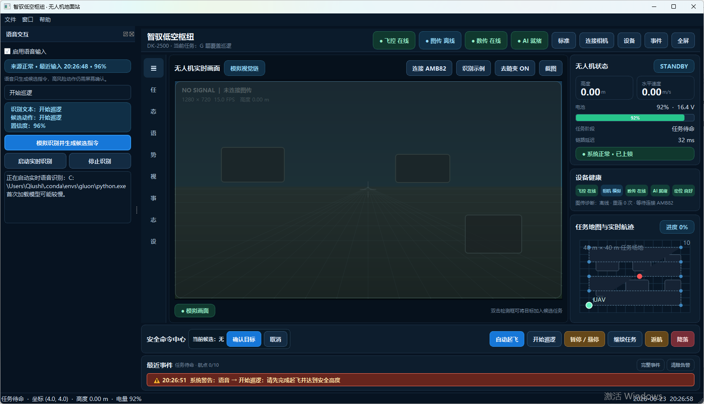

# Intel Cup 2026 · Ground Station

当前分支维护地面站、图传、火源识别、语音识别、手势识别和视线识别相关代码。

## 当前代码状态

- 图传：OK，支持 AMB82 RTSP / 快照回退，地面站界面可连接相机。
- 数传：OK，可以与飞控连接，通过串口实时输入。
- 语音识别：OK，已接入 OpenVINO Whisper 实时识别，识别文本会进入候选指令流程。
- 手势识别：OK，已接入 MediaPipe 三手势识别，可触发暂停、取消候选、确认候选。
- 视线识别：OK，已接入头部姿态 + 视线融合识别，可显示方向并触发确认/取消。
- 手势 + 视线场景：OK，手势先选择起飞/自检/返航大类，倒数 5 秒后用视线选择三个细项。
- 飞行巡检：OK，连接无人机图传后常驻运行人脸与中英文 OCR 小模型；命中后触发 Qwen3-VL 复核，Qwen 也会按周期主动巡检画面。
- 巡检日志：OK，右侧“飞行记录”页签显示识别结果、Qwen3-VL 分析、飞行位置与截图，并持续追加到本地。

## 运行截图



## 目录

```text
ground_station/      PyQt5 地面站、任务地图、告警与火源识别
voice_asr/           OpenVINO Whisper 实时语音识别
multimodal_recognition/ MediaPipe 手势识别与视线识别
pc_camera_viewer/    AMB82 RTSP/快照读取与独立预览程序
wireless_camera/     AMB82 720p H.264 RTSP 固件
recovery_blink/      AMB82 恢复与硬件连通测试
```

## 快速启动

Windows 下双击：

```text
run_ground_station.bat
```

或在当前目录运行：

```powershell
python -m pip install -r ground_station\requirements.txt
python ground_station\main.py
```

## 语音识别

地面站会优先调用 Anaconda 的 `gluon` 环境运行实时语音识别：

```text
C:\Users\Qiushi\.conda\envs\gluon\python.exe
```

如果换机器后缺少依赖，可运行：

```text
install_voice_asr_deps.bat
```

首次加载 Whisper/OpenVINO 模型会从 Hugging Face 下载模型，耗时较长。

## 手势与视线识别

地面站“多模态交互”窗口中可以直接启动或停止手势识别、视线识别。
两个识别器都会打开独立摄像头预览窗口，并把识别结果回传到地面站候选指令流程。

同一个 USB 摄像头通常一次只能被一个识别器占用，因此手势识别和视线识别不要同时开启。

也可以启动“手势+视线场景”单窗口流程：

- 左侧握拳：进入自检类，视线选择 `姿态自检 / 参数自检 / 摄像头状态`；
- 中间张开手掌：进入起飞类，视线选择 `仿真飞行 / 低空巡逻 / 定制航点`；
- 竖大拇指：进入返航类，视线选择 `立即返航 / 10秒后返航 / 日志输出`。

该场景流程同样使用一个 USB 摄像头，不要与其它识别窗口同时开启。
选择“日志输出”后，会把最近一次从解锁到重新锁定期间采样到的飞行数据导出到 `ground_station/flight_logs/flight_*/flight_log.md`。

## 飞行巡检与 Qwen3-VL

切换到无人机图传并成功收到画面后，地面站会优先在 NPU 上启动 OpenVINO 人脸模型，同时在 CPU 上运行中英文 OCR。NPU 不可用时会自动回退 OpenCV YuNet。火源继续使用原有连续帧确认链路。小模型命中后会立即保存截图并把任务送给常驻 GPU 的 Qwen3-VL；在没有命中时，Qwen 默认每 8 秒主动复核一次当前画面。

右侧窗口可在“设备 / 串口 / 网络”和“飞行记录”之间切换。每条飞行记录包含时间、识别摘要、飞行坐标与高度、Qwen 分析结果和截图。日志采用追加写入，不会因重启程序而丢失：

```text
ground_station/flight_logs/inspection_journal/inspection_log.jsonl
ground_station/flight_logs/inspection_journal/inspection_log.md
ground_station/flight_logs/inspection_journal/images/YYYYMMDD/
```

8GB 内存机器上，Qwen 仅在系统可用内存达到 1.4GiB 时启动；运行中若低于 0.8GiB，会暂停派发新任务但保留排队记录。周期可通过环境变量 `INTELCUP_QWEN_INTERVAL_SECONDS` 调整为 3–60 秒。

如果换机器后缺少依赖，可运行：

```text
install_multimodal_deps.bat
```
