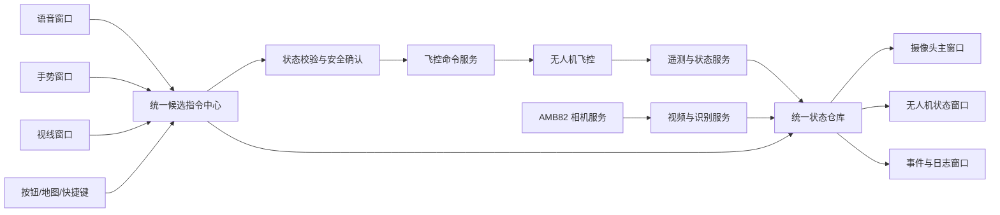

# 2026 英特尔杯无人机地面站 UI 项目交接文档

> 项目名称：智驭低空枢纽  
> 交接主题：地面站 UI 调研、产品结构与后续开发建议  
> 文档基线：2026 年 6 月 20 日  
> 当前工作区：`E:\2026Projects\1 IntelCup_Files`

---

## 1. 文档目的

本文档用于把目前已经完成的无线相机、电脑端预览和项目方案，交接给后续负责地面站 UI 调研与开发的成员。

它主要回答以下问题：

1. 地面站最终应该由哪些窗口组成。
2. 摄像头主窗口需要展示什么。
3. 语音、手势、视线等多模态输入窗口分别如何设计。
4. 无人机状态、任务规划、检测结果、安全控制和历史记录放在哪里。
5. 各窗口之间如何通信，避免重复开发和误触飞行命令。
6. 当前代码可以复用什么，下一步应按什么顺序实施。

本文档是一份 UI 与系统交互交接稿，不代表所有功能已经完成。文中明确区分：

- **已有实现**：当前工作区可以找到源码或历史验证记录。
- **待联调**：方案明确、接口可设计，但尚未完成端到端验证。
- **远期功能**：初选方案提出，需在基础闭环稳定后再开发。

---

## 2. 项目现状摘要

### 2.1 项目目标

以 Intel DK-2500 为地面智能枢纽，连接无人机飞控和无线摄像头，实现：

- 实时查看无人机摄像头画面；
- 显示无人机位置、姿态、电量、飞行状态和链路状态；
- 下发开始任务、暂停、返航、降落等高级命令；
- 规划并显示巡逻路线；
- 在视频中显示火源或目标识别结果；
- 支持语音、手势、视线等自然交互；
- 保存飞行历史、检测事件和任务报告。

### 2.2 当前已经具备的基础

| 模块 | 当前状态 | 可交接内容 |
| --- | --- | --- |
| AMB82-Mini 恢复与烧录 | 已完成基础流程 | `recovery_blink`、Realtek 工具链和恢复经验 |
| 无线相机固件 | 已有实现 | `wireless_camera/wireless_camera.ino` |
| Python 图像接口 | 已有实现 | `pc_camera_viewer/amb82_camera.py` |
| OpenCV 预览示例 | 已有实现 | `pc_camera_viewer/example_preview.py` |
| 电脑端 GUI 原型 | 部分完成 | `pc_camera_viewer/app.py` |
| 目标识别入口 | 已预留 | `process_frame()`、`detect_objects()` |
| 地面站 UI 第一版 | 已完成可运行原型 | `ground_station/`，含主窗口、状态、地图、多模态窗口和模拟器 |
| DK-2500 与飞控通信 | 待实现 | 需要确定 MAVLink、透明数传或自定义串口协议 |
| 无人机状态回传 | 待实现 | 需要定义统一遥测数据结构 |
| 语音、手势、视线 | 方案阶段 | 应分别开发、统一汇入命令总线 |
| 任务规划和历史记录 | 待实现 | UI 与数据结构需要从现在开始预留 |

### 2.3 当前最重要的工程判断

地面站不应让语音、手势、视线模块直接调用飞控接口。

所有输入必须先生成统一的“候选指令”，再经过：

1. 指令解析；
2. 当前飞行状态校验；
3. 风险等级判断；
4. 必要的人工确认；
5. 唯一的飞控通信服务下发。

这样可以防止语音误识别、手势误触或视线漂移直接改变无人机状态。

---

## 3. 推荐的 UI 总体结构

### 3.1 窗口设计原则

用户希望把多模态输入分别做成窗口，这是合理的，但建议采用：

**一个主窗口 + 多个可停靠、可浮动的工具窗口。**

推荐使用类似专业地面站、IDE 或视频编辑软件的布局：

- 摄像头画面是唯一主工作区；
- 无人机状态始终可见；
- 多模态窗口可以单独弹出，也可以停靠在主窗口左右两侧；
- 高风险操作只在固定安全区域执行；
- 所有窗口共享同一份无人机状态和任务状态。

不建议做成多个彼此独立、互不通信的应用程序，否则会出现：

- 每个窗口重复连接飞控或相机；
- 多个窗口同时下发矛盾命令；
- 状态显示不一致；
- 关闭某个窗口后后台线程没有停止；
- 难以统一记录日志。

### 3.2 推荐窗口清单

| 编号 | 窗口/面板 | 重要级别 | 默认状态 |
| --- | --- | --- | --- |
| W01 | 摄像头与任务主窗口 | P0 | 始终显示 |
| W02 | 无人机状态与健康监控窗口 | P0 | 默认停靠右侧 |
| W03 | 任务规划与地图窗口 | P0/P1 | 可切换到主工作区 |
| W04 | 语音交互窗口 | P1/P2 | 默认折叠 |
| W05 | 手势交互窗口 | P2 | 默认折叠 |
| W06 | 视线交互窗口 | P2 | 默认折叠 |
| W07 | 目标检测与事件中心 | P1 | 默认停靠下方 |
| W08 | 命令中心与安全控制窗口 | P0 | 固定区域 |
| W09 | 设备、串口与网络管理窗口 | P0/P1 | 设置页 |
| W10 | 飞行历史、回放与报告窗口 | P1/P2 | 独立页面 |
| W11 | 系统日志与开发调试窗口 | P0/P1 | 开发模式可见 |
| W12 | 模型与 AI 性能窗口 | P2 | 调试模式可见 |

### 3.3 推荐信息架构



---

## 4. 主窗口：摄像头画面与任务态势

### 4.1 主窗口定位

摄像头画面应占主窗口面积的 55%～70%，是操作员观察任务现场、选择目标和确认识别结果的主要区域。

主窗口不只是一个播放器，还应整合：

- 视频；
- AI 检测叠加；
- 飞行状态；
- 任务状态；
- 当前目标；
- 关键安全按钮；
- 小地图或航迹缩略图。

### 4.2 推荐布局

```text
┌─────────────────────────────────────────────────────────────────────────┐
│ 系统标题  飞控●  相机●  数传●  AI●       任务：巡逻中    计时 00:03:28 │
├──────────────────────────────────────────────┬──────────────────────────┤
│                                              │ 无人机状态               │
│                                              │ 模式 / 解锁 / 电量       │
│              摄像头实时画面                  │ 高度 / 速度 / 姿态       │
│                                              │ 定位质量 / 链路延迟      │
│     检测框、中心点、目标编号、置信度         ├──────────────────────────┤
│                                              │ 小地图 / 实时航迹        │
│                                              │ 航点、障碍、火源位置     │
├──────────────────────────────────────────────┴──────────────────────────┤
│ 最近事件：发现目标#03  置信度92%  (x=23.4,y=18.1)   [确认] [忽略]       │
├─────────────────────────────────────────────────────────────────────────┤
│ [开始任务] [暂停/悬停] [继续] [返航] [降落] [人工接管]                 │
└─────────────────────────────────────────────────────────────────────────┘
```

### 4.3 视频区域必须具备的功能

#### P0 基础功能

- 显示当前相机画面；
- 显示在线、重连、离线状态；
- 显示分辨率、实际 FPS、最近一帧时间；
- 截图；
- 开始/停止录像；
- 全屏；
- 断线时保留最后一帧，但覆盖明显的“画面已过期”提示；
- 禁止把旧画面继续显示为“实时”。

#### P1 任务功能

- 显示检测框、目标类型和置信度；
- 显示画面中心十字；
- 显示选中目标；
- 鼠标框选感兴趣区域 ROI；
- 双击目标进入“跟踪候选”；
- 将截图与当前无人机位置绑定；
- 在画面角落显示任务阶段、飞行模式和高度。

#### P2 增强功能

- 原始画面和 AI 画面切换；
- 热力图或分割掩膜；
- 多相机切换；
- 目标轨迹；
- 画面延迟估计；
- OpenVINO 推理设备、耗时和吞吐量显示。

### 4.4 画面叠加信息的层级

叠加信息过多会遮挡画面，应分为三层：

1. **始终显示**：相机状态、FPS、任务状态、时间。
2. **检测时显示**：检测框、类别、置信度、目标编号。
3. **调试模式显示**：推理时间、网络延迟、模型版本、坐标和日志。

用户应能一键切换：

- 简洁模式；
- 任务模式；
- 调试模式。

---

## 5. 多模态输入窗口

### 5.1 语音交互窗口

### 窗口目标

显示“系统听到了什么、理解成了什么、准备执行什么”，确保语音命令可解释、可撤销。

### 推荐界面内容

| 区域 | 内容 |
| --- | --- |
| 麦克风状态 | 设备名称、音量、是否静音、噪声水平 |
| 实时波形 | 当前音频输入和是否检测到人声 |
| 转写结果 | 原始识别文本 |
| 意图结果 | 解析后的动作、目标、参数 |
| 置信度 | 语音识别置信度、意图置信度 |
| 指令预览 | 即将提交的统一候选指令 |
| 确认区域 | 确认、取消、重新说、编辑参数 |
| 历史记录 | 最近语音命令、执行结果和失败原因 |

### 建议的第一版命令

- “显示无人机状态”
- “开始巡逻”
- “暂停任务”
- “继续任务”
- “返回起点”
- “降落”
- “截图”
- “标记当前目标”

### 安全限制

- 语音不得直接执行解锁、停桨或修改飞控参数；
- 起飞、返航、降落必须有屏幕确认；
- 低置信度命令不得进入执行队列；
- 相机或飞控离线时，窗口必须明确解释为什么不能执行；
- “停止”需要区分暂停、悬停、降落和电机停转，禁止语义模糊。

### 推荐指令展示方式

```text
识别文本：返回起点并降落

解析结果：
- 动作 1：返航 RTL
- 动作 2：自动降落 LAND
- 风险级别：高
- 当前状态：巡逻中，高度 1.8 m

[确认执行] [取消] [仅返航]
```

---

### 5.2 手势交互窗口

### 窗口目标

让操作员看到摄像头是否识别到本人、手部关键点是否稳定、手势被映射成了什么动作。

### 推荐界面内容

- 操作员摄像头画面；
- 手部骨架和关键点；
- 当前识别手势；
- 手势保持时间；
- 置信度；
- 当前映射命令；
- 启用/停用手势控制；
- 手势说明卡；
- 最近误识别记录；
- 校准和识别区域设置。

### 第一阶段建议只支持

| 手势 | 建议动作 | 是否直接执行 |
| --- | --- | --- |
| 五指张开 | 暂停任务并悬停 | 可直接执行，但需持续保持 |
| 握拳 | 取消当前目标选择 | 可直接执行 |
| 左右挥手 | 切换目标或界面页 | 可直接执行 |
| 指向画面 | 选择 ROI 或候选目标 | 不控制飞行 |
| 竖拇指 | 确认屏幕中的候选操作 | 仅低风险操作 |

### 不建议第一阶段使用

- 手势解锁；
- 手势起飞；
- 手势停桨；
- 用手部连续位置直接控制横滚和俯仰；
- 单帧识别后立即执行。

所有任务手势应满足：

- 连续识别若干帧；
- 保持一定时间；
- 用户处于指定识别区域；
- 与当前飞行状态兼容。

---

### 5.3 视线交互窗口

### 窗口目标

视线交互适合作为“选择工具”，不适合作为飞行控制器。

第一阶段建议实现：

- 注视点校准；
- 显示当前注视点；
- 高亮用户正在看的画面区域；
- 注视某个检测目标后将其设为候选目标；
- 注视小地图中的区域以快速定位；
- 配合语音完成“看着目标 + 说出动作”。

例如：

```text
用户注视目标 #05
用户说：“跟踪这个目标”
系统生成：TRACK_TARGET(target_id=05)
屏幕要求确认后再执行
```

### 推荐界面内容

- 操作员面部/眼部预览；
- 九点或多点校准；
- 校准质量；
- 当前注视坐标；
- 注视停留时间；
- 当前选中的界面元素；
- 候选目标；
- 视线数据是否有效；
- 重新校准按钮。

### 安全规则

- 视线只能选择，不能直接起飞、返航、降落或改变速度；
- 用户移开目光不能被解释为取消任务；
- 校准失效时自动禁用视线输入；
- 视线目标必须经过语音、按钮或手势确认。

---

## 6. 无人机状态与健康监控窗口

### 6.1 该窗口的重要性

无人机状态窗口不是普通仪表盘，而是所有命令能否执行的判断依据。任何多模态命令都必须读取这里的状态。

### 6.2 必须显示的数据

#### 连接与任务

- 飞控连接状态；
- 相机连接状态；
- 数传连接状态；
- 当前飞行模式；
- 是否解锁；
- 当前任务阶段；
- 当前航点；
- 任务已运行时间。

#### 飞行状态

- 高度；
- 本地坐标 X/Y/Z；
- 横滚 Roll；
- 俯仰 Pitch；
- 偏航 Yaw；
- 水平速度；
- 垂直速度；
- 距离起点；
- 累计航程。

#### 电源与健康

- 电池电压；
- 电池百分比；
- 电流；
- 预计剩余时间；
- 传感器健康；
- 光流质量；
- 测距状态；
- 定位质量；
- 遥控器是否在线；
- 失控保护状态。

#### 通信质量

- 串口或数传端口；
- 接收频率；
- 最近一包时间；
- 丢包率；
- 延迟；
- 信号强度（设备支持时）；
- 重连次数。

### 6.3 状态颜色规范

| 颜色 | 含义 | 示例 |
| --- | --- | --- |
| 绿色 | 正常、可用 | 飞控在线、定位良好 |
| 蓝色 | 正常工作状态 | 巡逻中、录像中 |
| 黄色 | 降级但可继续 | 帧率降低、定位质量变差 |
| 红色 | 危险或不可执行 | 低电量、飞控断线、失控保护 |
| 灰色 | 未知或未配置 | 没有接入测距模块 |

不要只依赖颜色，还应同时显示：

- 图标；
- 短文本；
- 可展开的原因说明。

### 6.4 告警展示

告警分三级：

1. **信息**：相机已重连、任务已开始；
2. **警告**：帧率下降、光流质量降低、电量不足；
3. **严重**：飞控失联、位置异常、低电触发返航。

严重告警必须：

- 保持在界面上，直到用户确认；
- 写入任务日志；
- 显示系统自动采取了什么措施；
- 不允许被普通通知覆盖。

---

## 7. 任务规划与地图窗口

### 7.1 任务规划窗口目标

用于定义 2023 G 题场地、障碍、航点、巡逻路线和起降区。

### 7.2 推荐功能

#### 场地编辑

- 设置地图尺寸；
- 设置坐标原点；
- 绘制障碍区域；
- 标记起飞区和降落区；
- 标记火源候选区域；
- 设置安全边界；
- 导入背景图。

#### 航线编辑

- 添加、删除和拖动航点；
- 自动生成割草式覆盖路线；
- 设置巡航高度和速度；
- 显示航段长度；
- 估算飞行时间；
- 检查航线是否穿越障碍；
- 检查是否超出边界；
- 设置返航点。

#### 任务执行

- 验证航线；
- 上传任务；
- 显示上传结果；
- 启动任务；
- 暂停；
- 从指定航点继续；
- 立即返航；
- 保存任务模板。

### 7.3 实时地图信息

地图运行时显示：

- 无人机当前位置和朝向；
- 已飞轨迹；
- 计划轨迹；
- 当前航点；
- 识别到的火源或目标；
- 起飞点；
- 信号和定位异常位置；
- 目标截图入口。

---

## 8. 目标检测与事件中心

### 8.1 事件中心目标

把 AI 检测结果从“视频上的框”变成可查询、可确认、可追溯的任务记录。

### 8.2 每条检测事件建议包含

```text
event_id
任务编号
目标类别
置信度
首次发现时间
最后出现时间
画面中的 bounding box
无人机位置
无人机高度
截图路径
模型名称和版本
人工确认状态
处置结果
备注
```

### 8.3 推荐界面

- 左侧：事件时间线；
- 中间：事件截图和检测框；
- 右侧：类别、置信度、坐标、状态和操作；
- 底部：确认、误报、忽略、设为目标、加入报告。

### 8.4 事件去重

同一目标可能连续几十帧被识别，不能每帧生成一条事件。

需要按以下条件聚合：

- 目标类别相同；
- 时间接近；
- 画面位置或空间坐标接近；
- 追踪 ID 相同。

最终用户看到的是“发现一个目标”，而不是几十条重复消息。

---

## 9. 命令中心与安全控制

### 9.1 统一命令来源

候选命令可能来自：

- 主界面按钮；
- 地图操作；
- 键盘快捷键；
- 语音；
- 手势；
- 视线；
- 自动任务逻辑；
- 安全保护模块。

命令中心必须记录每条命令的来源。

### 9.2 建议的统一命令结构

```python
CommandIntent(
    command_id="uuid",
    source="voice | gesture | gaze | button | mission | safety",
    action="TAKEOFF | HOLD | CONTINUE | RTL | LAND | SELECT_TARGET | ...",
    parameters={},
    created_at="timestamp",
    confidence=0.95,
    risk_level="low | medium | high | critical",
    requires_confirmation=True,
    state="proposed | confirmed | rejected | sent | acknowledged | failed",
)
```

### 9.3 风险等级建议

| 风险 | 操作 | 确认规则 |
| --- | --- | --- |
| 低 | 截图、切换界面、查询状态 | 可直接执行 |
| 中 | 选择目标、开始录像、加载任务 | 提示后执行 |
| 高 | 起飞、返航、降落、切换飞行模式 | 必须明确确认 |
| 严重 | 解锁、飞行中停桨、修改关键参数 | 默认禁止或需要管理员模式 |

### 9.4 主窗口固定安全按钮

主窗口底部建议始终保留：

- 暂停任务 / 悬停；
- 继续任务；
- 返航；
- 降落；
- 人工接管提示；
- 清除告警。

“飞行中立即停桨”不应作为普通 UI 大按钮。若确实需要，只允许在专门的紧急模式中出现，并明确警告会导致坠落。

---

## 10. 设备、串口与网络管理窗口

### 10.1 设备列表

应统一管理：

- 飞控串口；
- 无线数传；
- AMB82-Mini 相机；
- 操作员摄像头；
- 麦克风；
- 遥控器；
- 推理设备 CPU/GPU/NPU；
- 可选 OpenMV。

### 10.2 相机设置

- 自动发现；
- 手动输入地址；
- 当前 IP；
- 快照地址；
- 分辨率；
-轮询间隔；
- 超时；
- 自动重连；
- 测试连接；
- 显示最后错误。

网络密码不得显示在普通界面或日志中。

### 10.3 飞控设置

- 串口选择；
- 波特率；
- 协议类型；
- 连接/断开；
- 心跳；
- 消息频率；
- 只读测试模式；
- 模拟器模式。

### 10.4 模拟模式

UI 开发阶段必须提供模拟器，不应每次都连接真实无人机。

模拟器至少可以生成：

- 连接/断线；
- 电池变化；
- 高度和位置变化；
- 不同飞行模式；
- 巡逻任务进度；
- 低电告警；
- 相机断线；
- 发现目标事件。

这样能在不飞行的情况下完成大部分 UI 开发和演示。

---

## 11. 历史、回放和报告窗口

### 11.1 一次任务应保存

- 任务编号；
- 开始/结束时间；
- 使用的航线；
- 飞行状态时间序列；
- 实际轨迹；
- 视频或关键截图；
- 检测事件；
- 用户命令；
- 自动安全动作；
- 告警；
- 软件、固件和模型版本。

### 11.2 历史页面功能

- 按日期、任务和结果筛选；
- 查看任务摘要；
- 在地图上回放轨迹；
- 按时间同步回放视频和遥测；
- 查看目标事件；
- 导出 CSV；
- 生成 PDF 巡检报告；
- 标记成功、失败或中断原因。

### 11.3 报告建议内容

1. 项目和任务信息；
2. 飞行时间与航程；
3. 航线图；
4. 目标列表；
5. 目标截图；
6. 发现时间与位置；
7. 告警与人工操作；
8. 系统结论；
9. 软件、模型和固件版本。

---

## 12. 系统日志与调试窗口

### 12.1 日志分类

- UI 日志；
- 相机日志；
- 飞控通信日志；
- 命令日志；
- AI 推理日志；
- 安全告警；
- 用户操作记录。

### 12.2 日志级别

- DEBUG；
- INFO；
- WARNING；
- ERROR；
- CRITICAL。

### 12.3 开发模式与比赛模式

开发模式：

- 显示详细异常；
- 显示串口原始数据；
- 显示模型耗时；
- 允许保存调试包。

比赛模式：

- 只显示操作员能理解的信息；
- 隐藏技术堆栈；
- 自动保存完整后台日志；
- 报错时给出明确恢复步骤。

---

## 13. 推荐的软件架构

### 13.1 UI 框架建议

最终地面站建议从 Tkinter 迁移到 **PySide6**。

原因：

- 支持 `QMainWindow`；
- 支持 `QDockWidget`，适合多窗口停靠；
- 支持独立浮动窗口；
- 信号/槽适合线程间通信；
- 表格、树、地图、图表和设置页扩展能力更强；
- 更适合做比赛展示级界面。

当前 `app.py` 可以作为相机功能原型，不建议直接在其上无限增加窗口。

### 13.2 推荐技术组合

| 模块 | 建议 |
| --- | --- |
| UI | PySide6 |
| 视频 | OpenCV + NumPy |
| AI | OpenVINO，前期可先用简单颜色检测 |
| 飞控通信 | pymavlink 或经过封装的串口协议 |
| 串口 | pyserial |
| 数据模型 | dataclass 或 Pydantic 风格模型 |
| 本地数据 | SQLite |
| 图表 | Qt Charts、pyqtgraph 或自定义绘制 |
| 地图 | 第一阶段使用自定义二维场地画布 |
| 报告 | ReportLab 或 HTML 转 PDF |
| 日志 | Python logging，按任务分文件 |

### 13.3 推荐模块划分

```text
ground_station/
├─ main.py
├─ app/
│  ├─ main_window.py
│  ├─ state_store.py
│  ├─ command_bus.py
│  └─ safety_guard.py
├─ services/
│  ├─ camera_service.py
│  ├─ telemetry_service.py
│  ├─ flight_command_service.py
│  ├─ detection_service.py
│  ├─ voice_service.py
│  ├─ gesture_service.py
│  ├─ gaze_service.py
│  └─ recording_service.py
├─ models/
│  ├─ drone_state.py
│  ├─ camera_state.py
│  ├─ mission_state.py
│  ├─ command_intent.py
│  └─ detection_event.py
├─ ui/
│  ├─ camera_view.py
│  ├─ drone_status_dock.py
│  ├─ mission_planner.py
│  ├─ voice_dock.py
│  ├─ gesture_dock.py
│  ├─ gaze_dock.py
│  ├─ event_dock.py
│  ├─ device_settings.py
│  └─ history_page.py
├─ storage/
│  ├─ database.py
│  └─ repositories.py
├─ simulators/
│  ├─ drone_simulator.py
│  └─ event_simulator.py
└─ resources/
   ├─ icons/
   ├─ styles/
   └─ mission_templates/
```

### 13.4 线程与数据流原则

- UI 主线程只负责绘制和用户交互；
- 相机读取必须在后台线程；
- AI 推理必须在后台工作线程；
- 飞控串口必须由单一通信服务持有；
- 多模态识别不能阻塞主界面；
- 窗口不能直接互相调用，应读写统一状态仓库；
- 所有命令通过命令总线进入安全校验。

---

## 14. 核心数据模型建议

### 14.1 DroneState

```text
connected
last_heartbeat
armed
flight_mode
flight_phase
position_local: x, y, z
attitude: roll, pitch, yaw
velocity: vx, vy, vz
battery_voltage
battery_percent
current
optical_flow_quality
rangefinder_distance
localization_status
rc_available
failsafe_state
link_latency
packet_loss
current_waypoint
mission_progress
```

### 14.2 CameraState

```text
connected
url
resolution
fps
last_frame_time
frame_age
latency
reconnect_count
last_error
recording
recording_path
```

### 14.3 MissionState

```text
mission_id
mission_name
state
start_time
elapsed_time
waypoints
current_waypoint
progress
home_position
planned_distance
actual_distance
detected_targets
warnings
```

### 14.4 DetectionEvent

```text
event_id
target_type
confidence
timestamp
bbox
track_id
drone_position
drone_height
image_path
review_state
operator_note
```

---

## 15. 当前代码如何交接到新 UI

### 15.0 已创建的地面站原型

工作区现已包含 [ground_station](ground_station)：

- 摄像头主窗口；
- 无人机状态和任务地图；
- 安全命令中心；
- 语音、手势、视线三个可停靠窗口；
- 目标事件与系统日志；
- 设备连接窗口；
- 模拟遥测、任务状态和检测事件；
- AMB82Camera 可选接入。

该原型使用当前电脑已经安装的 PyQt5，目录结构和信号/槽设计可平滑迁移到 PySide6。

### 15.1 建议保留

#### `pc_camera_viewer/amb82_camera.py`

可以作为新地面站 `CameraService` 的基础，已经包含：

- 相机地址自动发现；
- 后台线程；
- 独立 JPEG 请求；
- 最新帧读取；
- 在线状态；
- FPS；
- 错误信息；
- 自动重连。

后续需要增加：

- 状态回调或 Qt 信号；
- 帧时间戳；
- 延迟统计；
- 重连次数；
- 可配置轮询间隔；
- 相机性能测试；
- 停止时更完整的线程回收。

#### `pc_camera_viewer/example_preview.py`

用于验证相机链路是否正常，不应直接成为最终 UI。

#### `pc_camera_viewer/example_detection.py`

用于接入第一版目标识别。

### 15.2 建议重构

#### `pc_camera_viewer/app.py`

当前 GUI 仍偏向传统视频流读取模式，与最新的独立 JPEG 相机封装不完全统一。

建议：

1. 不继续在该文件中堆叠所有地面站功能；
2. 将其截图、录像、目录管理等功能拆出；
3. 新 PySide6 项目直接调用 `AMB82Camera`；
4. 保留原文件作为早期原型和功能参考。

### 15.3 无线相机固件

`wireless_camera/wireless_camera.ino` 当前提供独立 JPEG。

需要后续测试：

- 连续运行稳定性；
- 每张图片大小；
- 实际 FPS；
- Wi-Fi 断开恢复；
- 客户端异常关闭后服务是否恢复；
- 手机热点与独立路由器的差异；
- 板端是否能够提高快照频率。

---

## 16. 推荐开发阶段

### 阶段 A：UI 调研与静态原型

目标：不连接真实无人机，先把信息架构确定下来。

交付物：

- 主窗口线框图；
- 各多模态窗口线框图；
- 状态字段清单；
- 颜色和告警规范；
- 命令确认流程；
- 可点击静态原型。

完成标准：

- 团队能在 3 分钟内说清每个窗口的作用；
- 同一信息只在一个主要位置维护；
- 高风险命令有明确确认流程；
- 主窗口在 1366×768 屏幕可用。

### 阶段 B：摄像头主窗口

目标：做出稳定的视频主窗口。

功能：

- 相机自动发现；
- 画面显示；
- 在线/离线；
- 截图；
- 录像；
- FPS；
- 最后一帧年龄；
- 断线重连；
- 假数据无人机状态栏。

### 阶段 C：无人机状态与模拟器

目标：先用模拟遥测驱动 UI。

功能：

- DroneState；
- 状态面板；
- 模拟飞行；
- 告警；
- 任务阶段；
- 命令中心；
- 日志。

### 阶段 D：真实飞控通信

目标：只读接入飞控，再逐步开放命令。

顺序：

1. 读取心跳；
2. 读取模式和解锁状态；
3. 读取位置、高度和电量；
4. 读取定位质量；
5. 测试安全的状态查询；
6. 测试暂停/悬停；
7. 测试返航和降落；
8. 最后才测试起飞。

### 阶段 E：任务规划与检测事件

目标：形成比赛任务闭环。

功能：

- 场地地图；
- 割草式航线；
- 任务进度；
- 红色火源检测；
- 事件记录；
- 火源坐标；
- 截图和报告。

### 阶段 F：多模态输入

推荐顺序：

1. 语音；
2. 手势；
3. 视线。

原因：

- 语音最容易做出清晰的命令和确认流程；
- 手势适合暂停、确认和界面控制；
- 视线校准和误触问题最多，应最后接入。

---

## 17. UI 调研时重点参考的产品类型

后续调研不应只看“无人机地面站长什么样”，还可以看：

- Mission Planner：飞控参数、地图和任务规划；
- QGroundControl：飞行状态、任务和仪表布局；
- 视频监控平台：多路画面、录像、事件时间线；
- 工业 SCADA：设备健康、告警等级和状态颜色；
- 自动驾驶 HMI：目标叠加、接管和安全提示；
- IDE/专业编辑软件：可停靠窗口、多工作区；
- 安防事件平台：检测事件确认和报告；
- 医疗监护仪：关键信息优先级与严重告警。

调研时每个产品记录：

1. 主画面如何分区；
2. 哪些信息始终显示；
3. 关键操作放在哪里；
4. 告警如何出现和消失；
5. 多窗口如何管理；
6. 是否支持任务回放；
7. 用户如何确认高风险操作；
8. 断线和数据过期如何显示；
9. 适合本项目借鉴的点；
10. 不适合本项目的复杂功能。

---

## 18. UI 设计验收清单

### 主窗口

- [ ] 相机画面是视觉中心；
- [ ] 相机离线和画面过期能明显区分；
- [ ] 无人机关键状态始终可见；
- [ ] 任务状态始终可见；
- [ ] 高风险按钮固定、不会被窗口遮挡；
- [ ] 可以快速进入地图和事件中心；
- [ ] 1366×768 下不需要横向滚动。

### 多模态

- [ ] 每个输入有独立窗口；
- [ ] 能显示原始输入和解析结果；
- [ ] 能显示置信度；
- [ ] 能看到候选命令；
- [ ] 高风险命令必须确认；
- [ ] 可以单独禁用某种输入；
- [ ] 所有输入共享同一命令中心。

### 状态与告警

- [ ] 数据过期时不继续显示为正常；
- [ ] 严重告警不会自动消失；
- [ ] 告警记录进入历史；
- [ ] 颜色之外还有文字和图标；
- [ ] 相机、飞控、数传、AI 状态彼此独立。

### 数据与日志

- [ ] 每次任务有唯一编号；
- [ ] 命令记录来源；
- [ ] 检测事件与位置绑定；
- [ ] 能导出截图和任务摘要；
- [ ] 软件、固件和模型版本可追踪。

---

## 19. 当前未决问题

后续开发前需要团队确认：

1. 最终使用 F260 哪一套飞控和通信协议；
2. 是使用 Mission Planner 并行运行，还是完全自制地面站；
3. 数传硬件型号和串口连接方式；
4. 光流和测距模块是否已经安装；
5. 无人机坐标使用本地坐标还是经纬度；
6. 火源位置由飞控位置近似，还是进行相机几何换算；
7. 操作员摄像头和无人机摄像头是否为两路独立设备；
8. 语音识别现有成果在哪里；
9. 比赛现场显示器分辨率；
10. 是否要求离线运行；
11. 报告生成是否属于最终演示范围；
12. 起飞、返航、降落的最终安全确认规则。

---

## 20. 推荐的下一项具体任务

建议下一步先完成一份 **地面站 UI 调研与低保真原型**，不要立即开始写所有功能。

最低交付内容：

1. 一个摄像头主窗口；
2. 一个无人机状态停靠窗口；
3. 一个任务地图窗口；
4. 三个独立的多模态窗口：语音、手势、视线；
5. 一个目标事件窗口；
6. 一个设备连接窗口；
7. 一套安全命令确认弹窗；
8. 一套状态颜色和告警规范。

推荐先用静态假数据完成原型评审，再接入当前的 `AMB82Camera`。这样 UI 架构不会被暂时不稳定的硬件链路拖着走。

---

## 21. 关键文件入口

- 项目总结：[IntelCup_项目总结.html](IntelCup_项目总结.html)
- 无线相机固件：[wireless_camera.ino](wireless_camera/wireless_camera.ino)
- 恢复固件：[recovery_blink.ino](recovery_blink/recovery_blink.ino)
- Python 相机接口：[amb82_camera.py](pc_camera_viewer/amb82_camera.py)
- OpenCV 预览：[example_preview.py](pc_camera_viewer/example_preview.py)
- 检测示例：[example_detection.py](pc_camera_viewer/example_detection.py)
- 电脑端 GUI 原型：[app.py](pc_camera_viewer/app.py)
- 当前使用说明：[README.md](pc_camera_viewer/README.md)
- 地面站 UI 入口：[main.py](ground_station/main.py)
- 地面站使用说明：[ground_station/README.md](ground_station/README.md)
- 当前界面预览：[preview.png](ground_station/preview.png)

---

## 22. 交接结论

当前项目最成熟的技术资产是 AMB82-Mini 到 Python/OpenCV 的无线图像入口，最欠缺的是飞控遥测、统一状态模型和地面站整体 UI。

下一阶段 UI 的核心不是“多做几个窗口”，而是建立一个统一、可信的操作体系：

- 摄像头画面负责观察；
- 地图负责任务空间；
- 状态窗口负责事实；
- 多模态窗口负责产生候选意图；
- 命令中心负责安全；
- 飞控服务负责唯一地下发；
- 日志与事件中心负责追溯。

只要先把这一套骨架搭好，后续接入语音、手势、视线、YOLO 和 OpenVINO 时，就不需要反复推倒重来。
