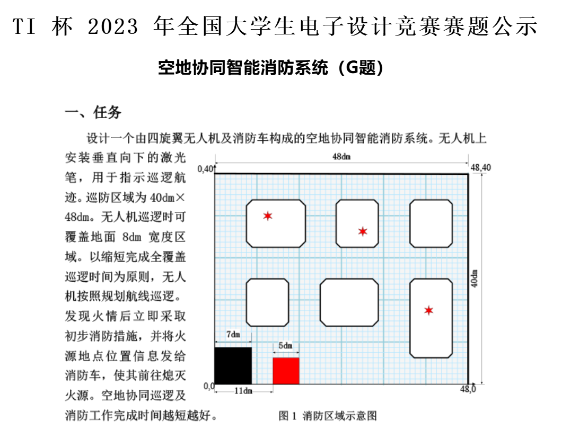
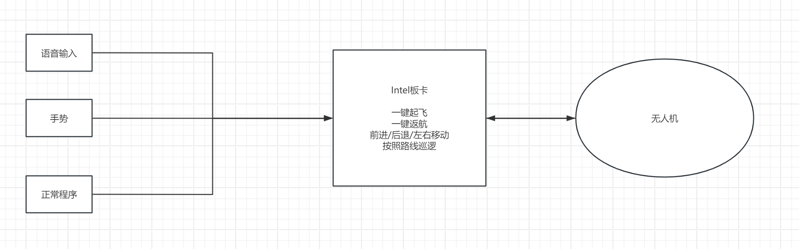

# 功能汇总

## 1 无人机功能

其实就是做这个题目的飞机部分，只需要无人机能按照规划好的航线进行飞行巡逻就可以。

1. 无人机上装一个垂直向下的激光笔，用来指示飞行的轨迹
2. 无人机能通过程序自动解锁并起飞，在固定高度悬停一段时间
   无人机能完成前进/后退/左右移动
   无人机能按照一条轨迹自动在地图上方全覆盖的扫描
3. 暂定用openmv做视觉，识别火源（题目中火源用红色led灯代替）
   识别到火源以后需要向Intel板卡回传一下坐标
4. 无人机飞控与Intel板卡-地面站可以建立通信-可以用数传 无线串口
   地面站能发送“开始”“立即返航”等任务给无人机，无人机做出相应反应
   无人机能每隔几秒钟向地面站发回当前状态+火源的识别结果

题目网址：https://res.nuedc-training.com.cn/topic/2023/topic_101.html原题是小车+无人机，不过我们做一个简化版的只有无人机的版本就行

## 2 板卡功能

1. 语音识别（已完成）
2. 图像识别（这个也可以先不管，把板卡的通信先打通吧）
3. 地面站与无人机做通信：
   地面站可以向无人机发送起飞、移动、返航等指令（多种输入方式，既可以直接在屏幕操作，也可以说话/手势）
   地面站可以显示无人机的坐标、飞行状态、火源识别结果和坐标等等信息
   可以做一个飞行历史记录，比如飞行时间，检测结果，每次飞行的路线（这个先当作可选，后面慢慢做）

