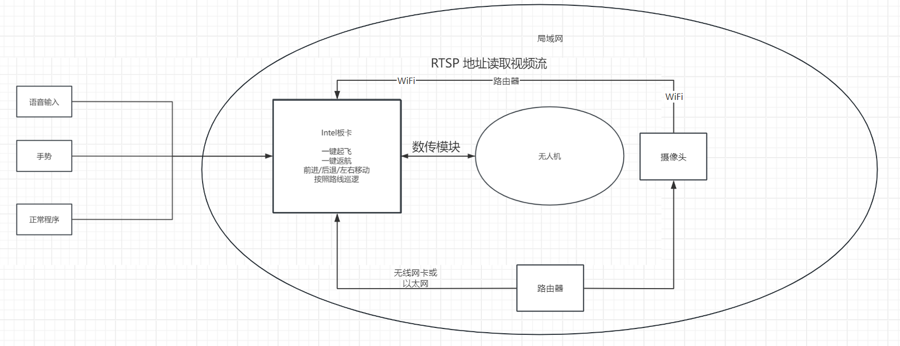
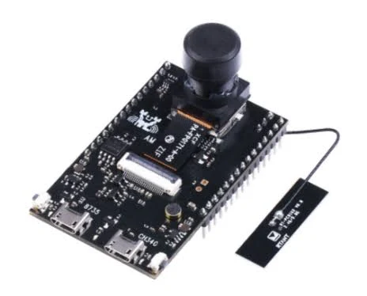
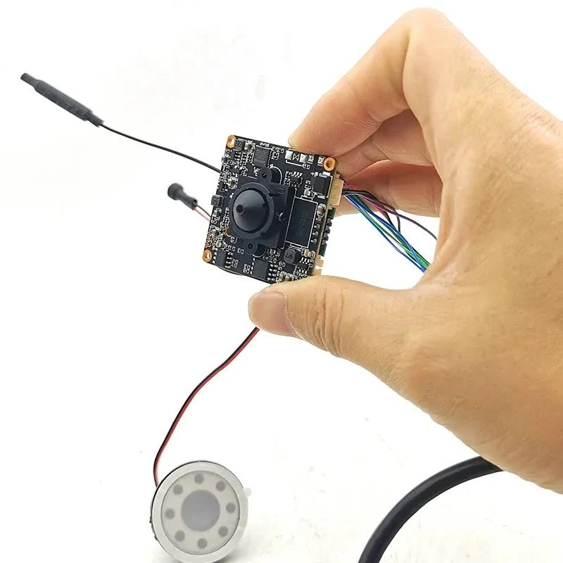

用路由器搭一个局域网应该是行得通的，也是最主流的摄像头连接方法。

摄像头通过连接WiFi获得一个地址，Intel板卡通过搜索这个局域网地址获取视频流，如下图：




**第一推荐：`RTSP WiFi 摄像头模块 38x38 1080P`**



电脑 Python 可以直接读：

```python
import cv2

cap = cv2.VideoCapture("rtsp://用户名:密码@摄像头IP:554/stream1")
```

适合本地程序接入。

**第二推荐：`ESP32-CAM OV2640 WiFi 摄像头模块`**



带 WiFi/蓝牙和 OV2640 摄像头。
不是 RTSP，而是 HTTP/MJPEG 流，画质、帧率、延迟都不如正经 IP 摄像头模块。能跑通 Python 图像处理。

Python 读取 ESP32-CAM 大概是：

```python
import cv2

url = "http://192.168.4.1:81/stream"
cap = cv2.VideoCapture(url)
```


