# Week1

# 0429

## 进度总览

今天新板子到了，买了键鼠套装、外接显示器成功了，烧写了Windows11系统。

### 1 硬件情况

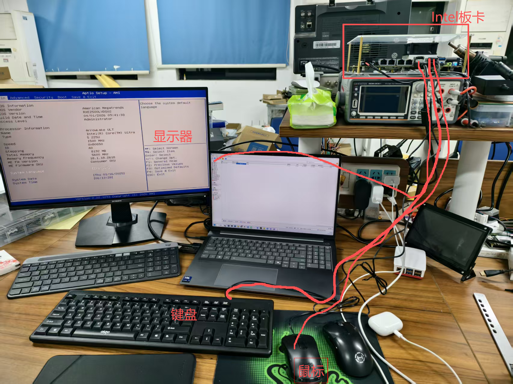

### 2 烧录系统

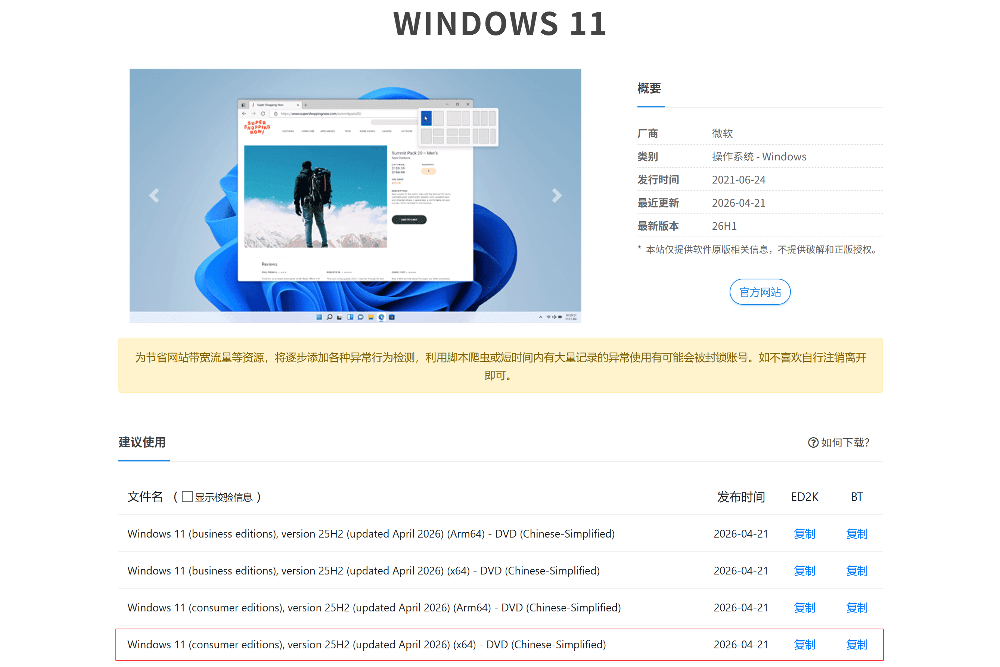

```
BT：
magnet:?xt=urn:btih:b27644de79e751ff874c2138d4168cef99a5a523&dn=zh-cn_windows_11_consumer_editions_version_25h2_updated_april_2026_x64_dvd_38233bf1.iso&xl=8658569216
```

这个镜像需要一个磁盘软件来下载

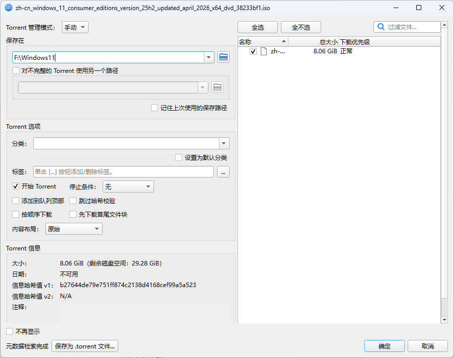

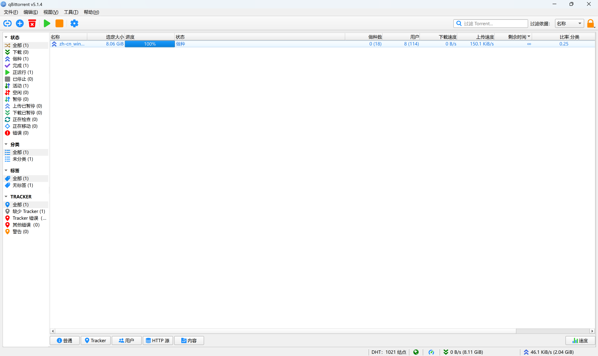

在UltraISO中打开Win11的.iso文件


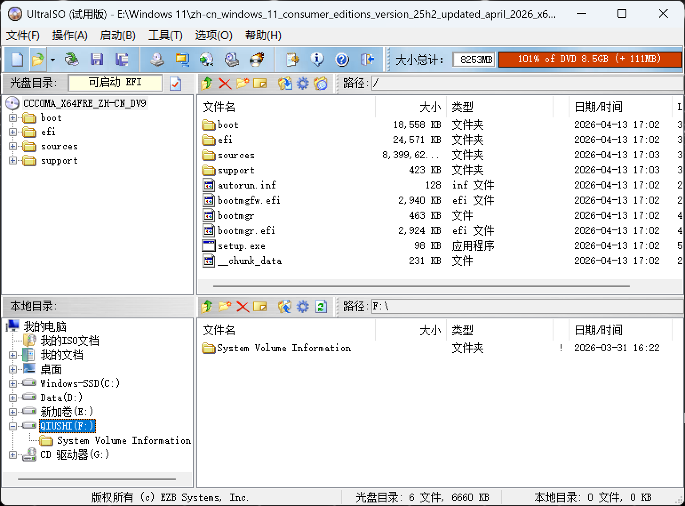

启动(B) → 写入硬盘映像...

要先格式化U盘再写入，这个U盘会作为板卡的系统盘

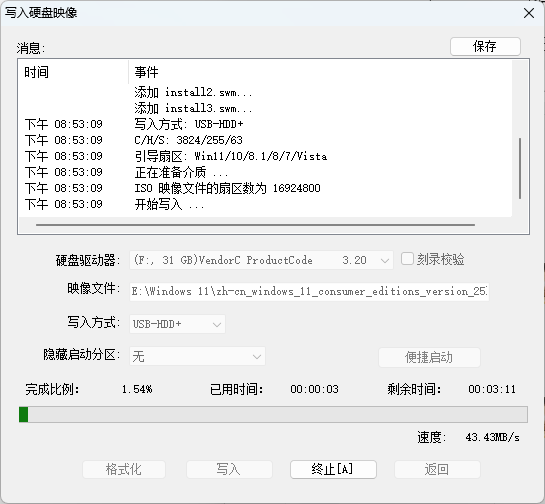	

后面直接跟着文档做了

### 3 系统安装

1.方法一：

目标主机插上启动盘，然后开机。

开机按F7，然后选择你的U盘为引导项。然后回车

方法二：

也可以开机按Delete，进入BIOS。

在BOOT选项中设置你的U盘为boot option#1

然后按F4保存

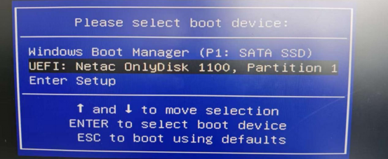 

 

 

 

2.进入U盘后，确认系统语言后，点击下一步

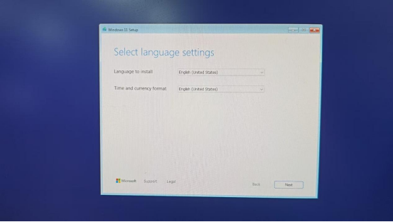 

3.选择安装Windows11，同意同款，点击下一步

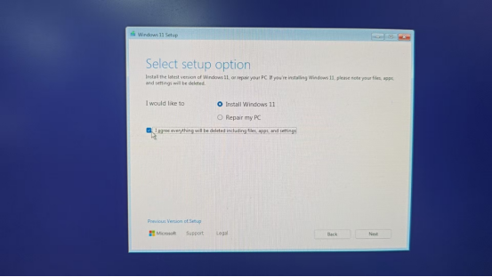 

 

 

4.点击我没有激活密钥

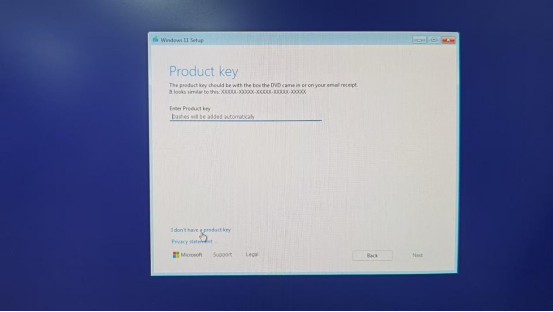 

 

 

 

1. 选择需要安装的系统

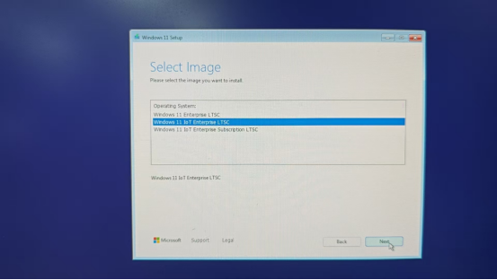 

2. 阅读条款后，点击“Accept”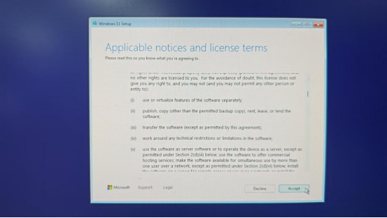

 

 

 

 

 

3. 进入磁盘分区界面。


把需要安装系统的硬盘分区删除后重新分配。

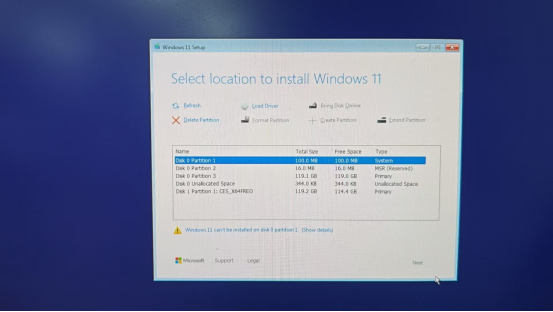

8.删除完成后如下图，点击新建，输入C盘需要的大小，新建C盘容量后，点击应用

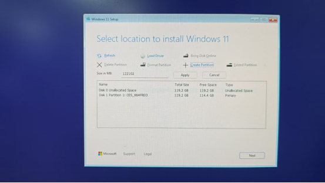 

 

 

 

 

9.选择分配的C盘系统盘

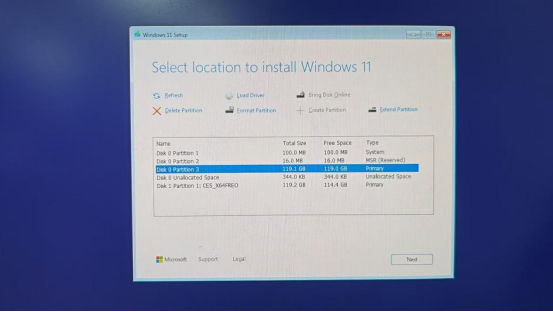 

 

 

10.点击“Install”

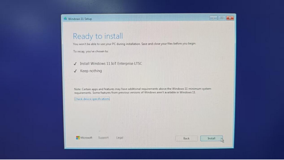


10. 选择地区，点击“Yes”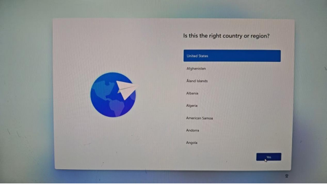 

 

 

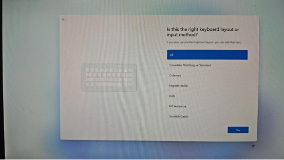 

 

 

 

 

 

 

 

 

11. 键盘布局，选择“跳过”

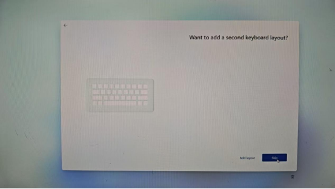 

 

12. 网络连接，选择I don't have intemet

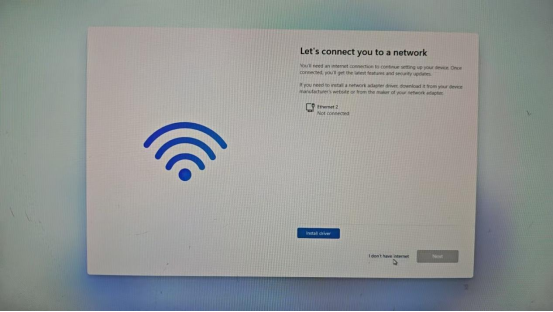 


13. 输入用户名后，点击下一步

 

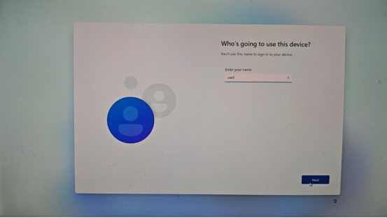 

 

 

14.是否需要密码，不需要直接点击“下一步”

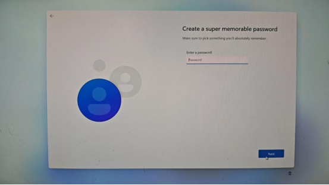 

 

 

14. 点击下一步

 

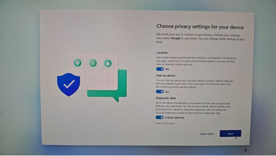 

 

 

16.点击下一步

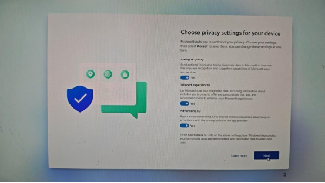


17.系统安装完成后安装主板驱动

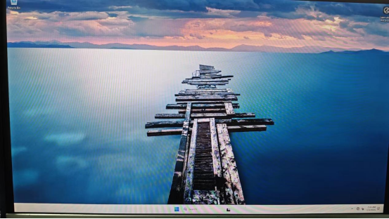
